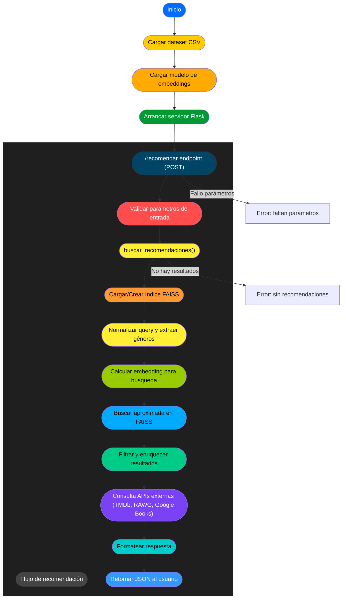

# Sistema de Recomendaciones Multimodal (Versión Local + API Flask)

Este proyecto implementa un **sistema de recomendación semántica** que integra datos de **películas, series, libros y videojuegos**.  
Fue desarrollado como parte de un **portfolio personal** y combina técnicas modernas de **NLP, embeddings y búsqueda semántica** con **índices FAISS** para ofrecer recomendaciones cruzadas de medios.

---

## 🔷 En la rama **"main"** se encuentra la versión local y en la **"master"** un prototipo de una futura versión web. 
En la versión final se rediseñó la lógica y estructura para cumplir con las condiciones de la versión gratuíta de Render, sin la librería **sentences-transform**.


> La versión desplegada en servidor, con API pública y frontend interactivo, se encuentra en desarrollo privado. Para poder usarla visitar mi portfolio.  [gcodev.es](https://gcodev.es/)  

---

## 🔷 Tecnologías utilizadas

- **Python 3.8+**
- **Flask** (API REST)
- **Pandas / NumPy**
- **Sentence-Transformers** (embeddings semánticos)
- **FAISS** (búsqueda vectorial eficiente)
- **RapidFuzz** (coincidencia difusa de títulos)
- **Requests** (integración con APIs externas)
- **APIs externas**:
  - [TMDb](https://www.themoviedb.org/) → Películas y series  
  - [Google Books](https://developers.google.com/books) → Libros  
  - [RAWG](https://rawg.io/apidocs) → Videojuegos  

---

## 🔷 Funcionalidades principales

- **Recomendaciones cruzadas** entre distintos tipos de medios (ej: buscar una película y recibir series, libros y videojuegos relacionados).  
- **Procesamiento de texto y embeddings** con `sentence-transformers`.  
- **Índices FAISS** optimizados para cada tipo de contenido.  
- **Enriquecimiento dinámico de datos** mediante APIs externas (títulos, descripciones, géneros, pósters, etc.).  
- **Filtros avanzados** por género y exclusión de combinaciones incoherentes (ej. `terror + infantil`).  
- **API REST lista para integrar en frontends** (ejemplo: Astro + React + Tailwind).  

---

## 🔷 Flujo



---

## 🔷 Estructura del proyecto

### Versión local 
```
├── main_web.py                   # Script principal (Flask API + recomendador)
├── requirements.py               # Ejecutor del código
├── dataset_fusionado_final_8.csv # Dataset base
├── Readme
```

### Versión Web (Prototipo)

```
recomendador-local/
├── api/
│   │   ├── __init__.py
│   │   ├── google_books.py
│   │   ├── tmdb.py
│   │   ├── videojuegos.py
├── main_web.py                   # Script principal (Flask API + recomendador)
├── requirements.txt              # Dependencias necesarias
├── dataset_fusionado_final_8.csv # Dataset base
├── modelos/                      # Modelos pesados / índices FAISS
│   ├── libro.index
│   ├── libro_metadata.pkl
│   ├── pelicula.index
│   ├── pelicula_metadata.pkl
│   ├── serie.index
│   ├── serie_metadata.pkl
│   ├── videojuego.index
│   ├── videojuego_metadata.pkl
├── utils/                        # Funciones auxiliares
│   ├── cache.py
│   ├── constantes.py
│   ├── recomendador.py
│   ├── scoring.py
│   ├── utils.py
│   ├── validacion.py
├── config/                       # Archivos de configuración / despliegue
│   ├── .dockerignore
│   ├── .env.example
│   ├── .gitignore
│   ├── .railwayignore
│   ├── Procfile
│   ├── render.yaml
     
```
## 📂 La versión **local.py** contiene todo el bloque seguido, listo para usar

### Para ejecutar usar:

```
python "local.py"
```


### A continuación abrir otra terminal y ejecutar:

```
python "request.py"
```


### Rellenar los datos con el título a elegir y dar a enter una vez estén todos rellenados, el sistema te mostrará las recomendaciones


---

## 🔷 Requisitos previos

- Python **3.8 o superior**
- pip (gestor de paquetes)
- Recomendado: entorno virtual (`venv`)

---

## 🔷 Instalación y uso

```bash
# Clonar el repositorio
git clone https://github.com/tuusuario/recomendador-local.git
cd recomendador-local

# Crear entorno virtual (opcional)
python -m venv env
source env/bin/activate   # Linux/macOS
env\Scripts\activate      # Windows

# Instalar dependencias
pip install -r requirements.txt
```

### Ejecutar el servidor Flask

```bash
python "main.py"
```

El servidor quedará disponible en:  
 `http://127.0.0.1:5000`

---

## 🔷 API Flask – Endpoints

###  `POST /recomendar`

Genera recomendaciones cruzadas de medios.

**Body JSON:**
```json
{
  "query": "El señor de los anillos",
  "tipo_origen": "pelicula",
  "tipo_destino": "todos",
  "top_k": 5
}
```

**Parámetros:**
- `query` *(str, obligatorio)* → Título de referencia.  
- `tipo_origen` *(str, opcional, default="pelicula")* → Tipo del contenido base (`pelicula`, `serie`, `libro`, `videojuego`).  
- `tipo_destino` *(str|list, opcional, default="pelicula")* → Tipo de los resultados (`pelicula`, `serie`, `libro`, `videojuego`, `"todos"`).  
- `top_k` *(int, opcional, default=5)* → Número máximo de resultados.  

**Ejemplo con `curl`:**
```bash
curl -X POST http://127.0.0.1:5000/recomendar
-H "Content-Type: application/json"
-d '{"query": "El señor de los anillos", "tipo_origen": "pelicula", "tipo_destino": "todos"}'
```

**Respuesta (ejemplo simplificado):**
```json
{
  "combinadas": [
    {
      "titulo": "The Hobbit",
      "tipo": "libro",
      "descripcion": "...",
      "poster": "https://...",
      "puntuacion": 8.9,
      "generos": ["fantasy", "adventure"]
    },
    {
      "titulo": "Game of Thrones",
      "tipo": "serie",
      "descripcion": "...",
      "poster": "https://...",
      "puntuacion": 9.1,
      "generos": ["fantasy", "drama"]
    }
  ]
}
```

---

## 🔷 Evaluación de calidad

### En pruebas internas:  
Categoría Criterio de evaluación Nº de casos Porcentaje

🟢 Buenas más del 70% de recomendaciones coherentes 182 -> **86,26%**

🟡 Regulares entre 30% y 70% de recomendaciones coherentes 23 -> **10,90%**

🔴 Malas menos del 30% de recomendaciones coherentes 6 -> **2,84%**


> Esto valida la **robustez del sistema semántico**, aunque aún hay margen de mejora en enriquecimiento de metadatos.

---

## 🔷 Posibles mejoras futuras

- Base de datos persistente (MongoDB, PostgreSQL).  
- Frontend visual interactivo (Astro + TailwindCSS + React).  
- Panel de administración para gestión de fuentes externas.  
- Autenticación y perfiles de usuario.
- Abrir las categorías a documentales, programas de tv, etc...
- Sistema híbrido (contenido + colaborativo).  

---

## 🔷 Contacto

### **Gerardo Blázquez Moreno**  

📌 Portfolio: [gcodev.es](https://gcodev.es/)  
✉️ Email: gerardo.blazquez32@gmail.com
🌐 LinkedIn: [linkedin.com/in/gerardoblazquez](https://www.linkedin.com/in/gerardo-bl%C3%A1zquez-moreno-a71551195/)   


